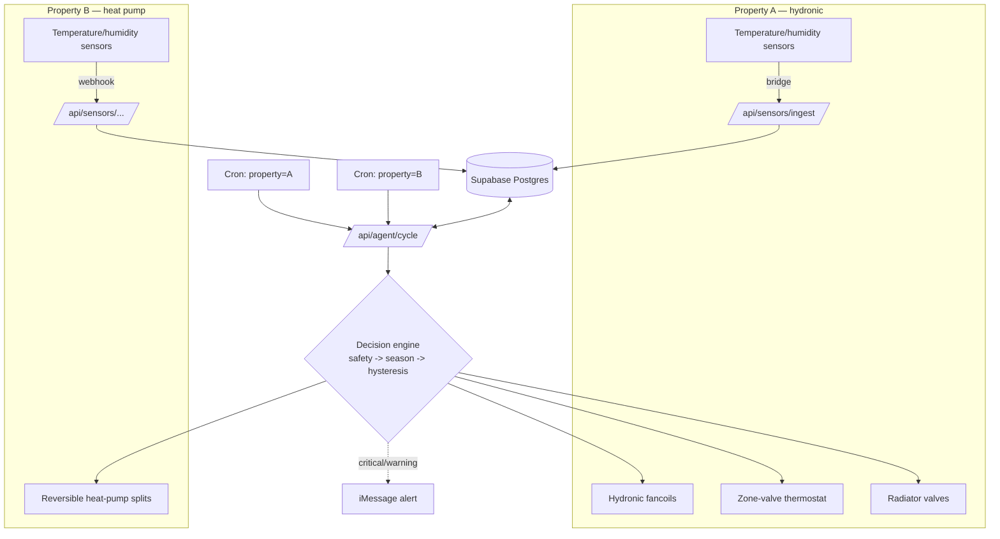

# ThermoLeo

A serverless, multi-property home heating and cooling agent: independent room sensors in, on/off hysteresis decisions out, every cron tick, forever.

[](#)
[](LICENSE)
[](#)
[](#)

## Why

ThermoLeo runs two real homes, 24/7, unattended: an apartment on hydronic fancoils and a seaside house on Mitsubishi splits. It has no daemon, no long-running process, and no memory beyond a Postgres row — a cron tick fires a stateless HTTP handler that reads every sensor, decides what each room needs, sends the commands, and writes the resulting state back to Supabase before the next tick starts from scratch.

The core idea is accurate measurement driving simple control. Fancoils, splits, and thermostats all have onboard sensors, but they sit inside or next to the heat/cold source, so they read the appliance, not the room. ThermoLeo ignores them: each room gets an independent external sensor placed away from the source, and the agent drives every source on/off around the room's target temperature with a hysteresis dead-band — turn on when the room drifts past the threshold on one side, off when it crosses back on the other. No PID, no modulation guesswork: honest readings, a target, a dead-band, and rate limits so hardware doesn't flap.

On top of that sits a safety layer, designed around the hardest room in the house — a nursery. Its bounds are a hard, season-independent clamp that no comfort logic, override, or bug can cross; every other room has its own wider clamp.

This repository is published as a reference implementation of a system actually running two homes, not as a general-purpose product. See [Getting started](#getting-started) before you fork it.

## Features

- Stateless control loop — no server process, no in-memory state, safe to redeploy or cold-start at any time
- Multi-property dispatch from one codebase, one cron schedule per property, isolated state per property
- Hard-clamped nursery safety bounds that bypass every other decision path
- Sensor-staleness detection with a dedicated `SENSOR_FAULT` mode and defensive actuation
- Season-aware invariants (heat / cool / off) with fail-safe defaults on read error
- Per-room hysteresis state machine with rate limiting on mode and command changes
- Vendor-agnostic actuation layer: hydronic fancoils, reversible heat-pump splits, radiator valves, a boiler-call thermostat
- Local launchd watchdog as a belt-and-braces fallback when the cloud cron lags
- Best-effort iMessage alerting for critical and warning conditions

## Architecture



Sensors feed Supabase through property-specific ingest webhooks. A per-property cron schedule invokes the same `/api/agent/cycle` handler with a `property` parameter; the handler reads current sensor state and prior agent state from Supabase, runs the decision engine, actuates the property's hardware, and persists the new state — all within a single stateless invocation.

### Modules

| Path | Role |
|---|---|
| `src/lib/agent/safety.ts` | Hard safety bounds, sensor-fault detection, `checkSafetyInvariants()` — the code that bypasses everything else |
| `src/lib/agent/season.ts` | Season flag (heat/cool/off) loader with fail-safe default and per-property cache |
| `src/lib/agent/state-machine.ts` | Per-room hysteresis state machine, fan/setpoint computation, rate limits |
| `src/lib/agent/state.ts` | Agent state persistence in Supabase, per-room control state and cooldowns |
| `src/lib/agent/thermostat.ts` | Boiler-call thermostat override strategy for the hydronic property |
| `src/lib/agent/campomarino.ts` | Second-property executor — reuses the shared decision helpers, drives MELCloud |
| `src/lib/{sabiana,netatmo,melcloud,legrand}/` | Vendor API clients |
| `agent/monitor.js` | Local launchd watchdog — same decision logic, adaptive polling, fallback path |

## How the control loop works

Each invocation of `/api/agent/cycle`:

1. **Authenticate.** Reject anything without a valid cron secret. Fail closed.
2. **Fetch in parallel.** Room targets, prior agent state, season setting, and the latest sensor readings for the requested property.
3. **Check safety invariants first.** Hard-clamped rooms and stale-sensor rooms are handled before any comfort logic runs. A sensor gone silent past its freshness cutoff flips that room into `SENSOR_FAULT` and drives it to a defensive default, never to "do nothing and hope."
4. **Resolve season.** Heating, cooling, or off — each with different invariants and different fallback behavior on error.
5. **Run the per-room hysteresis state machine.** Compare each room's current reading against its target and dead-band, decide mode/fan/setpoint, respecting per-room and per-property rate limits.
6. **Actuate.** Send commands to the property's vendor API (fancoils, splits, valves, thermostat).
7. **Persist state.** Write the new agent state back to Supabase so the next stateless invocation has continuity.
8. **Alert if warranted.** Critical or warning conditions trigger a best-effort iMessage notification; the control loop itself never depends on the alert succeeding.

## Hardware and integrations

Devices the current setup runs, per property. Anything with a cloud API and the same read/decide/actuate shape can be added as a vendor client under `src/lib/`.

| Integration | Property | Role | Devices in the reference deployment |
|---|---|---|---|
| Sabiana Cloud | A — hydronic apartment | Actuation | 5 hydronic fancoils (mode, setpoint, fan speed) |
| Legrand / Bticino Smarther | A — hydronic apartment | Actuation | Zone-valve thermostat gating the boiler call for the whole loop |
| Netatmo | A — hydronic apartment | Actuation | Radiator valves (antifreeze fallback in cooling season) |
| Sonoff SNZB-02D (via Homey) | A — hydronic apartment | Sensing | Per-room temperature/humidity, bridged through a Homey flow |
| Shelly | A — hydronic apartment | Sensing | Temperature/humidity, pushes over webhook |
| MELCloud (Mitsubishi Electric) | B — heat-pump house | Actuation | 3 reversible splits, full heat/cool/off per room |

## Supabase

Supabase Postgres is the only stateful component — the entire agent memory between cron ticks lives in these tables:

| Table | Holds |
|---|---|
| `properties` | One row per home (timezone, coordinates for weather) |
| `rooms` | Per-room config: targets, hard safety bounds, fan profile, `actuation_enabled`, criticality |
| `sonoff_bridge` | Latest bridged sensor readings, with freshness cutoffs enforced by the agent |
| `readings` | Historical time series for the dashboard |
| `tokens` | Key-value state per provider and property: agent state, OAuth tokens, overrides, season |
| `agent_actions` | Audit log of every command the agent sent |
| `alerts` | Alert history with cooldowns |

Migrations in `supabase/migrations/` are numbered and build on each other (001 base schema → 004 multi-property → 006/007 second-property seed and activation). Apply them in order with `supabase db push` or by running the SQL files sequentially. Scheduling can come from Vercel Cron (as deployed here) or from Supabase `pg_cron` calling the cycle endpoint — the handler doesn't care who ticks it.

## Safety design

- **Hard clamps, not preferences.** The nursery's safety bounds are a fixed range that no season, override, or comfort setting can widen. Every other room has its own, wider hard bounds — nothing in the system operates outside a bound.
- **Sensor-fault mode.** A room whose sensor has gone stale past its freshness cutoff does not fall back to "last known good and keep going" — it enters a distinct `SENSOR_FAULT` state with its own defensive actuation, and is surfaced as an alert.
- **No-actuation defaults.** New rooms and newly seeded properties ship with actuation disabled until their sensor feed is validated live. The agent reads and logs a disabled room every cycle; it never commands it.
- **Season-aware invariants.** Off-season behavior (no heating or cooling source available) is a distinct code path, not an edge case of heat/cool — automatic commands suspend, safety invariants stay armed.
- **Calibration knobs, isolated per property.** Hysteresis dead-bands, fan ladders, and rate limits are tunable per room and per property without touching the shared decision helpers or the safety path.

## Getting started

This is a reference implementation of a live deployment, not a turnkey product. The room and property seeds in `supabase/migrations/` describe one family's homes. Forking this to control your own house means replacing those seeds with your own rooms, vendors, and safety bounds — not just changing environment variables.

### One-command setup with Claude Code

```bash
git clone https://github.com/fabioparisi/thermoleo && cd thermoleo && npm install && claude "Read README.md, docs/ and supabase/migrations/, then interview me about my home (rooms, heating/cooling hardware, sensors, Supabase project) and adapt the seeds, vendor clients and safety bounds to my setup."
```

Claude Code walks the codebase and does the adaptation work interactively — the parts below are the same steps done by hand.

### Manual setup

```bash
git clone https://github.com/fabioparisi/thermoleo
cd thermoleo
npm install
cp .env.example .env.local   # fill in your own vendor credentials and secrets
```

Apply the Supabase migrations in order (they are numbered and build on each other):

```bash
supabase db push   # or apply supabase/migrations/*.sql in numeric order against your project
```

Deploy to Vercel and point a cron at `/api/agent/cycle?property=<your-property-id>` for each property:

```bash
vercel deploy --prod
```

Adapt before going live on your own hardware:

- Replace the room/property rows seeded by the migrations with your own.
- Rewrite or remove the vendor clients (`src/lib/sabiana`, `src/lib/melcloud`, `src/lib/netatmo`, `src/lib/legrand`) for the hardware you actually own.
- Set your own safety bounds in `safety.ts` and the seeded `rooms` table — do not deploy with someone else's nursery clamp as your default.

## Project structure

```
src/app/api/          Route handlers — agent cycle, sensor ingest, vendor status/command, OAuth callbacks
src/app/               Dashboard UI (rooms, history, settings)
src/lib/agent/         Decision engine — safety, season, state machine, thermostat, per-property executors
src/lib/{sabiana,netatmo,melcloud,legrand}/   Vendor API clients
src/components/        UI components
agent/                 Local launchd watchdog (fallback path)
supabase/migrations/   Numbered schema + seed migrations
tests/unit/            Unit tests for safety bounds, namespacing, payload builders
tests/e2e/             End-to-end cycle invariants
docs/                  Architecture, agent loop, API reference, hydronic topology
```

## Testing

```bash
npm run lint          # ESLint
npx tsc --noEmit      # Type check
npm run test:e2e       # Vitest end-to-end cycle invariants
npx vitest run tests/unit
```

## Acknowledgments

ThermoLeo stands on these projects:

- [Next.js](https://github.com/vercel/next.js) + [Vercel Cron](https://vercel.com/docs/cron-jobs) — the stateless runtime and its heartbeat
- [Supabase](https://github.com/supabase/supabase) / [supabase-js](https://github.com/supabase/supabase-js) — all persistent state
- [shadcn/ui](https://github.com/shadcn-ui/ui), [Base UI](https://github.com/mui/base-ui), [Recharts](https://github.com/recharts/recharts), [lucide](https://github.com/lucide-icons/lucide), [sonner](https://github.com/emilkowalski/sonner), [Tailwind CSS](https://github.com/tailwindlabs/tailwindcss) — the dashboard
- [Homey](https://homey.app) local API — the Sonoff sensor bridge
- Vendor cloud APIs: Sabiana, Mitsubishi Electric MELCloud, Netatmo, Legrand/Bticino Works with Netatmo
- [Vitest](https://github.com/vitest-dev/vitest) — tests

No third-party code is vendored into this repo; everything above is consumed as a dependency or an API.

## License

MIT — see [LICENSE](LICENSE).
