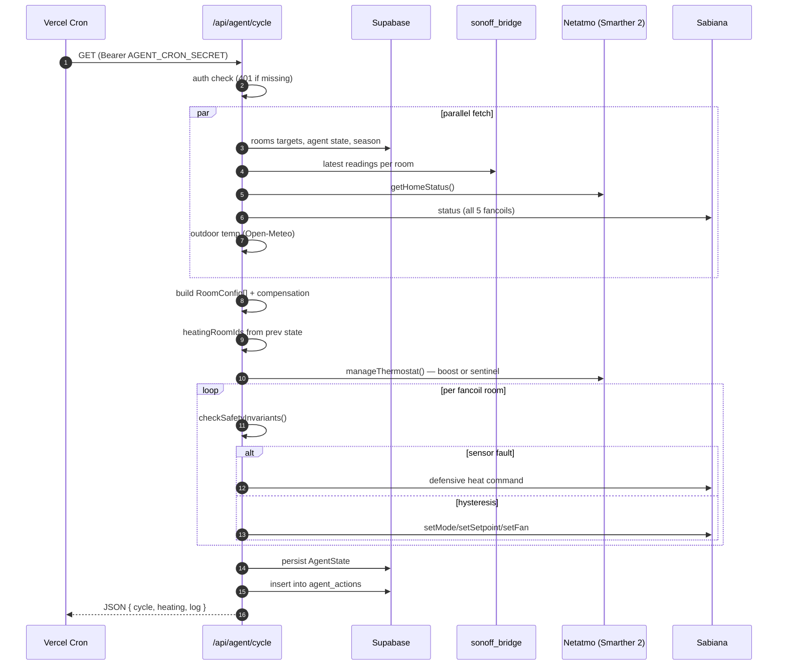

# Agent Loop — `/api/agent/cycle`

A single invocation is stateless. Vercel Cron pings the endpoint every 2 minutes.

## Sequence



## Per-room state machine (`src/lib/agent/state-machine.ts:processRoom`)

```
                  ┌──────────────────┐
   sensor fault   │                  │   safety violation
   ▶▶▶▶▶▶▶▶▶▶▶▶▶▶│   SAFETY checks  │◀◀◀◀◀◀◀◀◀◀◀◀◀◀
                  │                  │   (Nursery, bounds)
                  └────────┬─────────┘
                           │ ok
                           ▼
            ┌─────────────────────────────┐
            │   Hysteresis decision        │
            │   target ± SATISFIED_MARGIN  │
            └──┬──────────────────────┬────┘
               │ below target         │ above target + margin
               ▼                      ▼
        ┌──────────────┐       ┌──────────────┐
        │   HEATING    │──────▶│  SATISFIED   │
        │  fan↑ setpt↑ │       │  fan→0 off   │
        └──────┬───────┘       └──────┬───────┘
               │ rate-limited           │
               ▼                        ▼
        Sabiana command           Sabiana command
        (4 mode/h, 8 cmd/h)
```

## Key constants

| Constant | Value | Source |
|---|---|---|
| `POLL_ACTIVE_MS` | 120 s | `agent/monitor.js` |
| `POLL_NORMAL_MS` | 600 s | `agent/monitor.js` |
| `THERMOSTAT_COOLDOWN_MS` | 5 min | `agent/monitor.js`, `src/lib/agent/thermostat.ts` |
| `SATISFIED_MARGIN` | small Δ above target | `src/lib/agent/state-machine.ts` |
| `ALERT_COOLDOWN_MS` | 30 min per severity | `agent/monitor.js` |
| `SENSOR_FAULT_THRESHOLD` | 3 consecutive nulls | `src/lib/agent/safety.ts` |
| Nursery safety bounds | 18–28 °C hard | `src/lib/agent/safety.ts` |
| Other-room safety bounds | 16–30 °C hard | `src/lib/agent/safety.ts` |
| Rate limits per room | 4 mode/h, 8 cmd/h | `src/lib/agent/state-machine.ts` |
| Sentinel valve setpoint | 28 °C, 10-min endtime | `src/lib/agent/thermostat.ts` |

## Two runtimes, same logic

The agent ships in two forms:

| | Vercel route | Local Mac loop |
|---|---|---|
| File | `src/app/api/agent/cycle/route.ts` | `agent/monitor.js` |
| Trigger | Vercel Cron every 2 min | launchd, adaptive (2 min active / 10 min normal) |
| State | Supabase `tokens` row | Same Supabase row |
| Purpose | Primary | Belt-and-braces fallback when Vercel Cron lags or fails |

The Vercel route is the authority. The local loop exists because Vercel Cron has occasionally skipped runs, and because the launchd job is what keeps fresh Sonoff data flowing into Supabase regardless of cloud availability.

## See also

- [System Architecture](system-architecture.md)
- [Local Agent](local-agent.md)
- [API Reference](api-reference.md)
- [Testing Guide](testing-guide.md)
